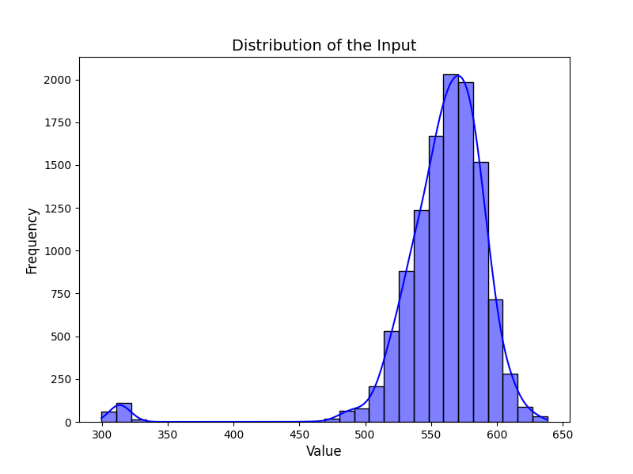
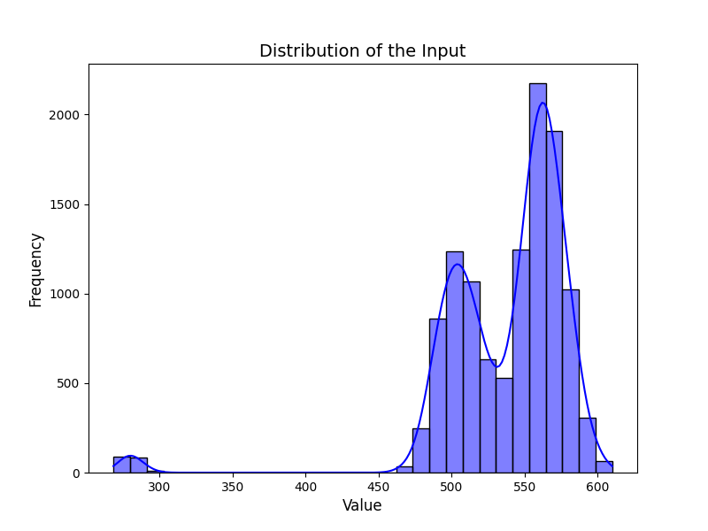
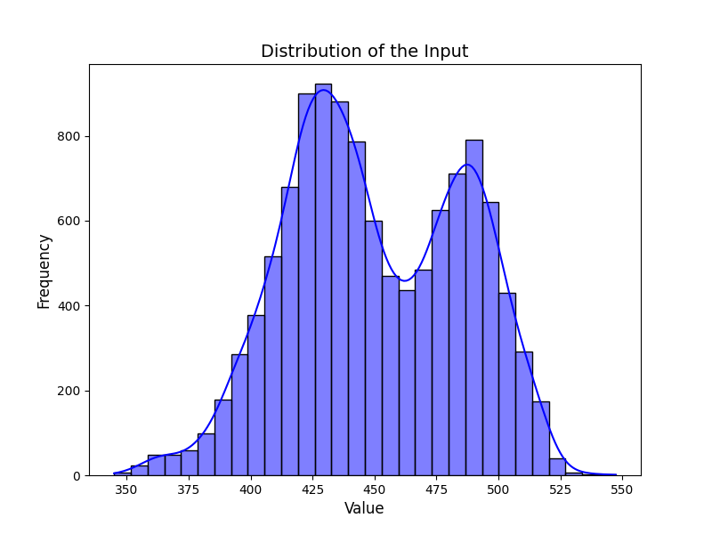

# Sorbet
Code for Sorbet model

## Quick start
run `bash run_glue.sh $TaskName$`

## Training hyperparameters

| Dataset | Max Seq Length | Batch Size | Learning Rate |
| ------- | -------------- | ---------- | ------------- |
| mnli    | 128            | 120        | 1e-5          |
| mrpc    | 128            | 40         | 1e-6          |
| sst-2   | 64             | 100        | 1e-6          |
| sts-b   | 128            | 30         | 5e-7          |
| qqp     | 128            | 100        | 1e-5          |
| qnli    | 128            | 80         | 1e-6          |
| rte     | 128            | 10         | 5e-6          |

Note: All the distillation steps are run for 100 epochs with an early stop setting.

## Clarification for Assumption B.1 in the paper
We show the distribution of the L1 norm of the inputs to the normalization layers by randomly sampling 3 batches and plotting the figures. The distribution supports our assumption that B.1 is mild regarding the L1 norm value. It's important to note that, due to the high feature dimension (768) in Sorbet, these values can be quite large. However, even with a reduction to 128 dimensions, the assumption still holds.

